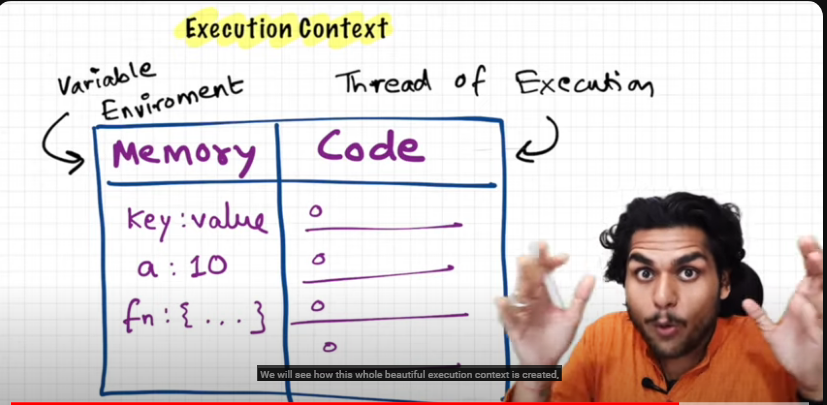

### How Javascript Works

1. JS is intepreted , Dynamically typed , single threaded programming language.
(JS is just in time Compiled language)

2. Javascript is Synchronous Single threaded language.

- Everything in js happens inside an "Execution Context"

