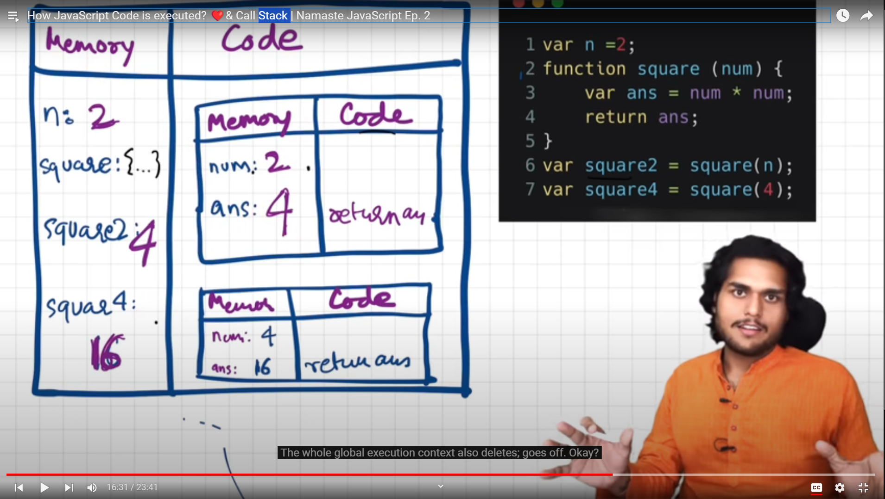

### How JS code is executed ?.

- suppose we have a program

```js
var n = 2;
function square(num) {
  var ans = num * num;
  return ans;
}

var square2 = square(n);
var square4 = sqaure(4);
```

Now the Global execution context is created in 2 phases.



#### 1. Memory Creation phase

- JS will allocate memory to all variables and functions
- Stores a special value for variables i.e `Undefined`
- And for functions it stores the whole code.

#### 2. Code Execution Phase

- In this phase , the value of variables is initialised.

- And when the function is invoked a new execution context is made.

- Again the same process happens
- When it encounters the `return` keyword, it returns the control of program to the place where the function was invoked.
- Whole execution context will be deleted after invokation.


### Call Stack
- It uses Call Stack to store the execution context.
- Same as stack in Recursions :)

"Call Stack maintians the order of execution of execuiton contexts."

